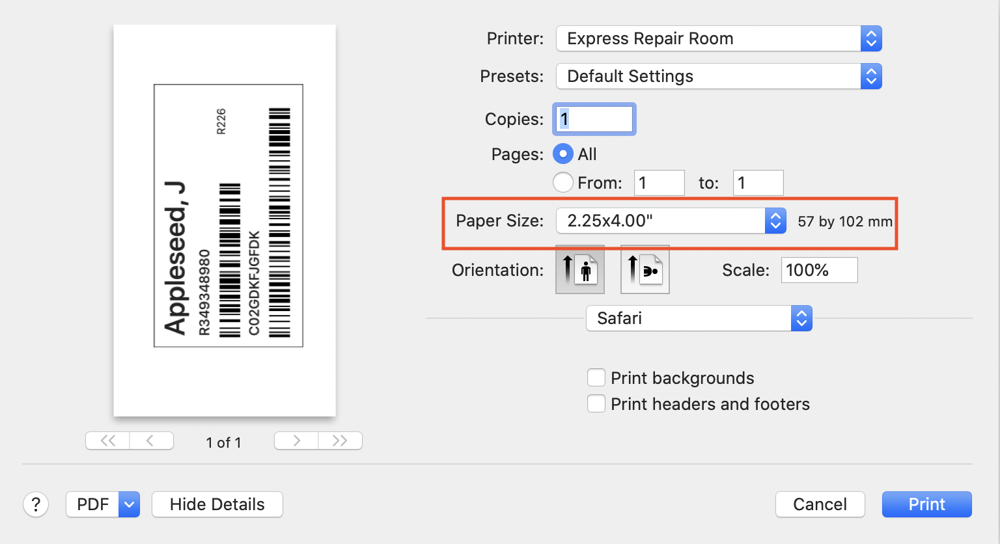

**To turn this project into a .app:**
1. Open 'Script Editor' on your Mac
2. Paste the following:
    do shell script "open https://rbsam176.github.io/labelgenerator/index.html"
3. Click File > Save
4. Change the File Format to Application
5. Name the file 'Label Generator'
6. Save it to your Desktop/Documents folder
7. Save the Zebra Printer PNG file from this repo
8. Open the PNG file in Preview, click Edit > Select All > Edit > Copy
9. Right click the Label Generator .app file, click Get Info
10. Click on the thumbnail in the top right, then press CMD-V (to paste), this will assign the .app the correct thumbnail

**To set up default printer settings**
1. Set up the Zebra label printer as directed on IST
2. Go to print a label:

3. Click on 'Paper Size' and select 2.25x4.00"

4. To make this be the default settings whenever you print, click on 'Presets', then 'Save Current Settings as Preset...' and give it a relevant name

